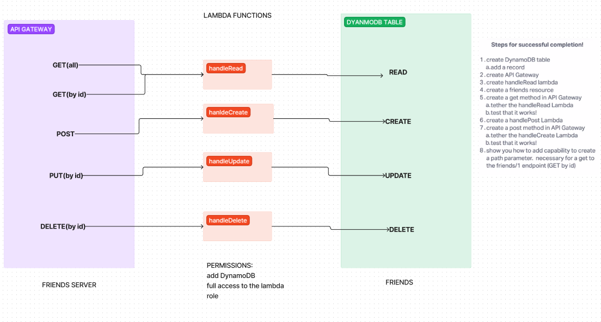

# LAB - Class 18

## Project: Serverless-API with DyanmoDB and Dynamoose

### Author: Student/Group Name

### Problem Domain  

Create a single resource REST API using a domain model of your choosing, constructed using AWS Cloud Services.

    Database: DynamoDB
        1 Table required.
    Routing: API Gateway
        POST
        /people - Given a JSON body, inserts a record into the database.
        returns an object representing one record, by its id (##).
        GET
            /people - returns an array of objects representing the records in the database.
            /people/## - returns an object representing one record, by its id (##).
        PUT
        /people/## - Given a JSON body and an ID (##), updates a record in the database.
        returns an object representing one record, by its id (##).
        DELETE
        /people/## - Given an id (##) removes the matching record from the database.
        returns an empty object.
    CRUD Operation Handlers: Lambda Functions

### Links and Resources

- [GitHub Actions ci/cd](https://github.com/ReeceRenninger/serverless-api/actions/new)

### Collaborators

- Ike, Ryan E, Kaeden the champions of table 4.

### Setup

#### `.env` requirements (where applicable)

for now I have none and do not require one

#### How to initialize/run your application (where applicable)

- e.g. `npm start`

#### How to use your library (where applicable)

#### Features / Routes / Processes

- GET : `/people` - grab all people in DB
- GET : `/people/##` - grab one person from DB by ID
- POST : `/people` - create new person into DB
- PUT : `/people/##` - update a person in DB by ID
- DELETE : `/people/##` - delete person in DB by ID

This lab went really well. We followed along with the demo code to get started and then using the dynamoose documentation we were easily able to target the id for updating, deleting, and grabbing one person by id.  Originally we were trying to combine the get one and get all functions as one function but we remembered Ryan G stating that separating your functionality out was more cost effective since it was less run time so we created a singular GET function and brought it down locally as well.

What is the root URL to your API?

- My root [URL](https://5458lgab8k.execute-api.us-west-1.amazonaws.com/Dev/people)

What are the routes?

- All my routes are listed above :).

What inputs do they require?

- Only the GET(singular), PUT, and DELETE require that an ID be fed into the API gateway to execute their functionality.

What output do they return?

- GET will return either a singular id and name or all ids/names within the DB. POST allows for you to create a new person with using my id and name schema. PUT allows you to select a created person by ID and update their name. Lastly, DELETE removes a person from the DB by their selected ID.

#### Tests

- npm test while inside the direct folder

#### UML

